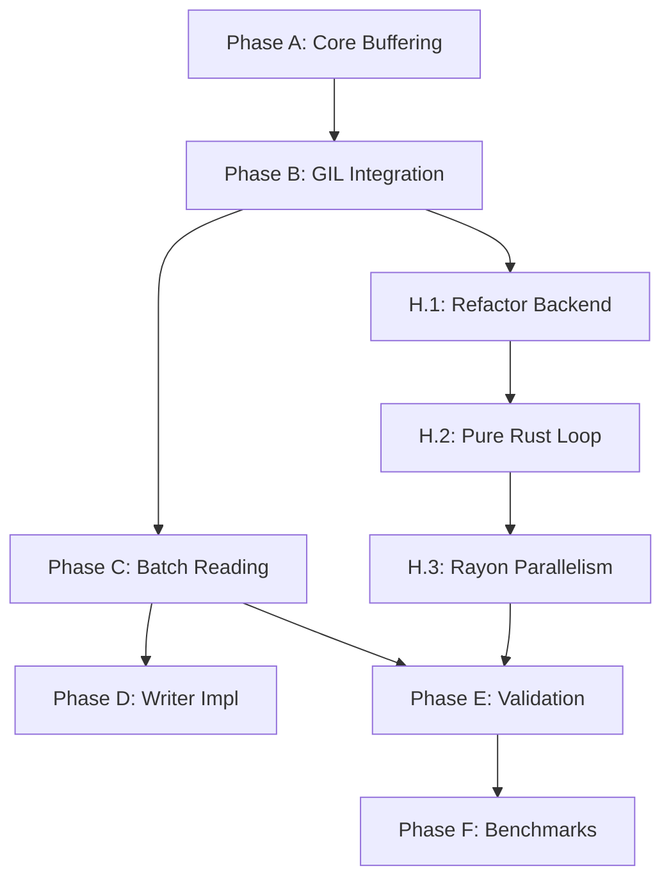

# Hybrid GIL Release Strategy: Batching & Pure Rust I/O

**Status:** Proposed Strategy  
**Date:** January 2, 2026  
**Related Documents:**
- [Review Findings & Recommendation](GIL_RELEASE_PROPOSAL_REVIEW.md)
- [Original Implementation Plan](GIL_RELEASE_IMPLEMENTATION_PLAN.md)
- [Punchlist](GIL_RELEASE_PUNCHLIST.md)

---

## 1. Executive Summary

This document outlines the **Hybrid Strategy** for achieving high-performance parallelism in `pymrrc`. It combines two complementary approaches to satisfy both backward compatibility and maximum performance requirements:

1.  **Compatibility Path (Batching)**: Repair the existing file-object reader using **Batch Reading (Phase C)**. This ensures that users passing `BytesIO`, sockets, or custom file-like objects still get a ~1.8-2.0x speedup.
2.  **Performance Path (Pure Rust I/O)**: Implement **Phase H**, a new code path that bypasses Python I/O entirely when a file path (`str`) is provided. This uses Rust's `std::fs` and `rayon` to achieve maximum possible parallelism (>3-4x speedup).

---

## 2. Revised Roadmap Structure

The original roadmap (Phases A-G) is modified. Phase C becomes required, and Phase H is added as the new "performance imperative."

| Phase | Name | Focus | Goal | Status |
|---|---|---|---|---|
| **A** | Core Buffering | Reliability | Safe GIL release mechanics | ✅ Complete |
| **B** | GIL Integration | Mechanics | Three-phase pattern integration | ⚠️ Failing Perf |
| **C** | **Batch Reading** | **Compatibility** | **Fix Phase B (Target: 1.8x)** | **▶️ NEXT** |
| **D** | Writer Impl | Feature | Write support | Pending C |
| **H** | **Pure Rust I/O** | **Performance** | **Max Speed (Target: >3x)** | **🆕 NEW** |
| **E** | Validation | QA | Thread safety & Correctness | Pending D/H |
| **F** | Benchmarking | Proof | Comparative analysis | Pending E |

---

## 3. Phase H: Pure Rust I/O Implementation Details

**Objective:** Enable `MARCReader("path/to/file.mrc")` to use a fully Rust-native, GIL-free pipeline.

### Architectural Change: Dual Backend
The `PyMarcReader` struct must support two modes of operation. We will introduce an enum to hold the underlying reader state.

**Current (Simplified):**
```rust
struct PyMarcReader {
    buffered_reader: BufferedMarcReader, // Wraps PyObject
}
```

**Proposed (Hybrid):**
```rust
enum ReaderBackend {
    /// Legacy mode: Wraps a Python file-like object (Phases A-C)
    PythonFile(BufferedMarcReader),
    /// Performance mode: pure Rust file handle (Phase H)
    RustFile(std::io::BufReader<std::fs::File>),
}

struct PyMarcReader {
    backend: ReaderBackend,
    decoder: MarcRecordDecoder, // Shared decoding logic
}
```

### Task H.1: Refactor `PyMarcReader` Construction
**Goal:** Update `__init__` to accept either a file-like object OR a string path.

*   **Input Check:**
    *   If input is `str` or `Path`: Initialize `ReaderBackend::RustFile`.
    *   If input has `.read()`: Initialize `ReaderBackend::PythonFile`.
*   **GIL Implications:** 
    *   `RustFile` backend **never** needs the GIL for I/O.
    *   `PythonFile` backend **always** needs the GIL for I/O (handled via Phase C Batching).

### Task H.2: Implement `next()` for `RustFile` Backend
**Goal:** Implement a zero-GIL read pipeline for the Rust backend.

*   Unlike the "Three-Phase Pattern" (Read-GIL → Parse-NoGIL → Convert-GIL), the Rust backend is:
    *   **Phase 1 & 2 (Combined)**: Read bytes AND Parse record in Rust (NO GIL).
    *   **Phase 3**: Acquire GIL only to convert the final `MarcRecord` to `PyObject`.
*   This removes the "Phase 1" bottleneck completely.

### Task H.3: Parallel Iterator (Rayon Integration)
**Goal:** Enable multi-threaded parsing for the Rust backend.

*   Since `RustFile` I/O is GIL-free, we can use `rayon` (or a thread pool) to read and parse ahead.
*   **Strategy:** Implement a `read_batch_parallel` method specific to the `RustFile` backend.
    *   Rust thread pool reads chunks of the file.
    *   Parses valid records.
    *   Queues them for Python conversion.
*   **Benefit:** True multi-core saturation.

---

## 4. Phase H Detailed Task List

These tasks should be added to the issue tracker/punchlist.

### H.1: `PyMarcReader` Refactoring (Dual Backend)
- **ID:** mrrc-phase-h-1
- **Description:** Refactor `PyMarcReader` struct to use an enum `ReaderBackend` that can hold either the existing `BufferedMarcReader` or a standard `std::io::BufReader<File>`.
- **Acceptance:**
    - Code compiles.
    - Existing tests pass (using Python file objects).
    - New unit test using a file path string succeeds.

### H.2: Implement Pure Rust Read Loop
- **ID:** mrrc-phase-h-2
- **Description:** Implement the `Iterator` logic for `ReaderBackend::RustFile`.
- **Details:**
    - Use `py.allow_threads()` to wrap the entire `read_record()` call (I/O + Parsing).
    - Only re-acquire GIL to return the result.
- **Acceptance:**
    - Confirm `read_record` releases GIL for the entire duration of I/O and parsing.
    - Benchmark comparison: Rust Backend vs Python Backend (Sequential).

### H.3: Implement `par_read_batch` (Parallel Rust I/O)
- **ID:** mrrc-phase-h-3
- **Description:** Optimize the Rust backend to use a thread pool (Rayon) for pre-fetching and parsing.
- **Details:**
    - Create a background worker that reads/parses `N` records into a channel/queue.
    - `__next__` simply pops from this queue (acquiring GIL only to convert).
- **Acceptance:**
    - 4-thread benchmark shows >3.5x speedup on large files.

---

## 5. Integration with Existing Plan

### Updated Dependency Graph



### Impact on Benchmarking (Phase F)
The benchmark suite must now compare three scenarios:
1.  **Legacy:** `MARCReader(open("file.mrc"))` (Slow, sequential)
2.  **Batching:** `MARCReader(open("file.mrc"))` (Improved, ~2x speedup via Phase C)
3.  **Rust Native:** `MARCReader("file.mrc")` (Max speed, >3x speedup via Phase H)

This tells a compelling story to users: *"For compatibility, use file objects. For raw speed, pass the filename directly."*
